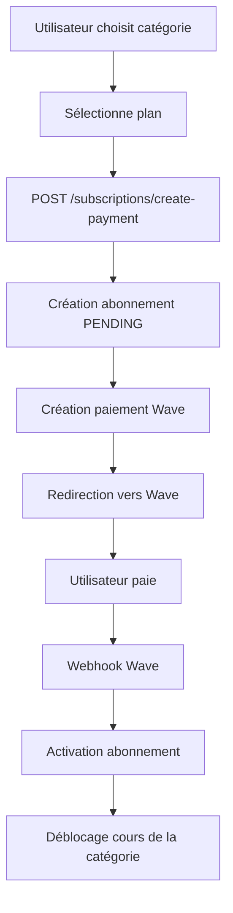

# Système d'Abonnement par Catégorie

## 📚 Principe

Le système d'abonnement fonctionne désormais **par catégorie de cours**. Lorsqu'un utilisateur s'abonne à une catégorie, il débloque **tous les cours de cette catégorie**.

## 🎯 Fonctionnement

### 1. Structure d'Abonnement

Chaque abonnement est lié à :
- **Un utilisateur** (`userId`)
- **Une catégorie de cours** (`category`)
- **Un plan** (`MONTHLY`, `QUARTERLY`, `ANNUAL`)
- **Dates** de début et fin

### 2. Catégories Disponibles

Les catégories et leurs tarifs (en XOF) :

| Catégorie      | Mensuel | Trimestriel | Annuel |
|---------------|---------|-------------|--------|
| Mathématiques | 3,000   | 8,000       | 25,000 |
| Physique      | 3,000   | 8,000       | 25,000 |
| Chimie        | 3,000   | 8,000       | 25,000 |
| Informatique  | 4,000   | 10,000      | 35,000 |
| Langues       | 2,500   | 6,500       | 20,000 |
| Sciences      | 3,500   | 9,000       | 30,000 |

### 3. Accès aux Cours

Un utilisateur a accès à un cours si :
1. ✅ Il a un **abonnement actif** pour la catégorie du cours
2. ✅ Il a **acheté le cours individuellement**

## 🔌 API Endpoints

### Créer un Abonnement

**POST** `/api/subscriptions/create-payment`

```json
{
  "userId": "user123",
  "category": "Mathématiques",
  "plan": "MONTHLY"
}
```

**Réponse :**
```json
{
  "success": true,
  "data": {
    "paymentUrl": "https://checkout.wave.com/pay/abc123",
    "paymentId": "wave_12345",
    "subscriptionId": "sub_abc123",
    "amount": 3000,
    "plan": "MONTHLY",
    "category": "Mathématiques",
    "currency": "XOF"
  },
  "message": "Paiement d'abonnement créé pour la catégorie \"Mathématiques\""
}
```

### Vérifier l'Accès à une Catégorie

**GET** `/api/subscriptions/check-access/:userId/:category`

```json
{
  "success": true,
  "data": {
    "userId": "user123",
    "category": "Mathématiques",
    "hasCategoryAccess": true
  }
}
```

### Obtenir Tous les Abonnements Actifs

**GET** `/api/subscriptions/check-access/:userId`

```json
{
  "success": true,
  "data": {
    "hasUnlimitedAccess": true,
    "activeSubscriptions": [
      {
        "category": "Mathématiques",
        "plan": "MONTHLY",
        "endDate": "2026-03-02T00:00:00.000Z"
      },
      {
        "category": "Physique",
        "plan": "ANNUAL",
        "endDate": "2027-02-02T00:00:00.000Z"
      }
    ]
  }
}
```

### Obtenir les Catégories et Tarifs

**GET** `/api/subscriptions/categories`

```json
{
  "success": true,
  "data": [
    {
      "category": "Mathématiques",
      "pricing": {
        "MONTHLY": 3000,
        "QUARTERLY": 8000,
        "ANNUAL": 25000
      }
    }
  ]
}
```

### Obtenir les Plans d'une Catégorie

**GET** `/api/subscriptions/plans?category=Mathématiques`

```json
{
  "success": true,
  "data": {
    "category": "Mathématiques",
    "plans": [
      {
        "plan": "MONTHLY",
        "price": 3000,
        "duration": "1 mois"
      },
      {
        "plan": "QUARTERLY",
        "price": 8000,
        "duration": "3 mois"
      },
      {
        "plan": "ANNUAL",
        "price": 25000,
        "duration": "12 mois"
      }
    ]
  }
}
```

## 🔒 Middleware d'Accès

Le middleware `checkCourseAccess` vérifie automatiquement :

1. Récupère le cours demandé
2. Identifie sa catégorie
3. Vérifie si l'utilisateur a un abonnement actif pour cette catégorie
4. Sinon, vérifie s'il a acheté le cours individuellement
5. Autorise ou refuse l'accès

**Exemple de message d'erreur :**
```json
{
  "success": false,
  "message": "Accès refusé. Vous devez acheter ce cours ou souscrire à la catégorie \"Mathématiques\".",
  "data": {
    "courseCategory": "Mathématiques",
    "hasSubscription": false,
    "hasCourseAccess": false,
    "options": {
      "buyCourse": "/api/wave/create-payment",
      "subscribeToCategory": "/api/subscriptions/plans?category=Math%C3%A9matiques"
    }
  }
}
```

## 🔄 Flux de Paiement



## 📊 Structure de Données

### Subscription Model

```typescript
{
  id: string;
  userId: string;
  category: string;           // Nouvelle propriété
  plan: "MONTHLY" | "QUARTERLY" | "ANNUAL";
  status: "ACTIVE" | "EXPIRED" | "CANCELLED" | "PENDING";
  amount: number;
  currency: string;
  startDate: Date;
  endDate: Date;
  paymentId?: string;
  paymentMethod?: string;
  autoRenew: boolean;
  createdAt: Date;
}
```

## 💡 Exemples d'Usage

### Frontend - Afficher les Catégories

```typescript
// Récupérer toutes les catégories disponibles
const response = await fetch('/api/subscriptions/categories');
const { data } = await response.json();

// Afficher la liste avec les tarifs
data.forEach(({ category, pricing }) => {
  console.log(`${category}:`);
  console.log(`  - Mensuel: ${pricing.MONTHLY} FCFA`);
  console.log(`  - Trimestriel: ${pricing.QUARTERLY} FCFA`);
  console.log(`  - Annuel: ${pricing.ANNUAL} FCFA`);
});
```

### Frontend - Créer un Abonnement

```typescript
const subscribeToCategory = async (userId: string, category: string, plan: string) => {
  const response = await fetch('/api/subscriptions/create-payment', {
    method: 'POST',
    headers: { 'Content-Type': 'application/json' },
    body: JSON.stringify({ userId, category, plan })
  });
  
  const { data } = await response.json();
  
  // Rediriger vers Wave
  window.location.href = data.paymentUrl;
};
```

### Frontend - Vérifier l'Accès

```typescript
const checkAccess = async (userId: string, category: string) => {
  const response = await fetch(`/api/subscriptions/check-access/${userId}/${category}`);
  const { data } = await response.json();
  
  return data.hasCategoryAccess; // true/false
};
```

## 🎨 Avantages du Système

1. ✅ **Flexibilité** : L'utilisateur peut s'abonner à plusieurs catégories
2. ✅ **Économique** : Tarifs adaptés par catégorie
3. ✅ **Ciblé** : L'utilisateur ne paie que pour ce qui l'intéresse
4. ✅ **Évolutif** : Facile d'ajouter de nouvelles catégories
5. ✅ **Compatible** : Fonctionne avec les achats individuels

## 🚀 Migration

Les anciens abonnements sans catégorie continueront de fonctionner via la méthode `hasUnlimitedAccess()` qui retourne `true` si l'utilisateur a au moins un abonnement actif.

Pour ajouter la catégorie aux anciens abonnements, exécuter un script de migration sur Firestore.

## 📝 Notes

- Un utilisateur peut avoir plusieurs abonnements actifs (une par catégorie)
- Chaque abonnement fonctionne indépendamment
- L'expiration d'un abonnement ne touche que la catégorie concernée
- Le système est rétrocompatible avec les achats de cours individuels
